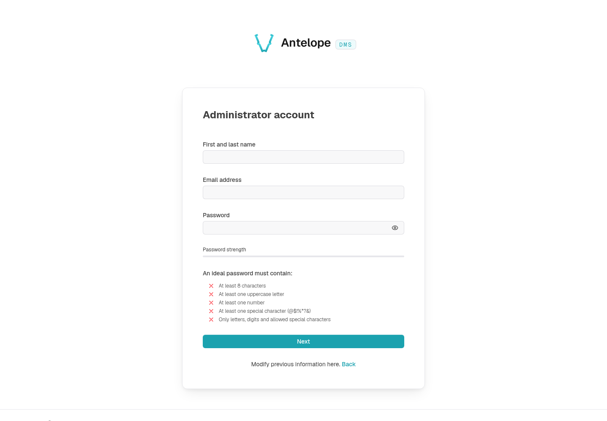

# Quickstart

Start from [template-dms-demo](https://github.com/AntelopeJS/template-dms-demo). It includes the module configuration, TypeScript build, a custom frontend layer, a component catalog, and a seeded demo application. You do not need to assemble a module stack or create another template.

## Choose your starting point

| Template | Use it when |
| --- | --- |
| [template-dms-demo](https://github.com/AntelopeJS/template-dms-demo) | You want the AntelopeJS CLI to run the backend and the Vue frontend loader to serve the dashboard. This is the path below. |
| [template-dms-adonis](https://github.com/AntelopeJS/template-dms-adonis) | You already use AdonisJS and want it to own the runtime lifecycle. Its README documents the separate Adonis and DMS API listeners; it is not a drop-in replacement for this dashboard walkthrough. |

## Install the demo

Use Node.js 22 and pnpm 10.2.0, and start MongoDB 8 locally. Redis is optional for this single-instance demo. Run these commands in a new directory:

```bash [Terminal]
git clone https://github.com/AntelopeJS/template-dms-demo.git my-app
cd my-app
cp .env.example .env
pnpm install --frozen-lockfile
pnpm build
pnpm exec ajs project modules install
```

The last command installs the runtime modules declared in `antelope.config.ts`; `pnpm install` alone installs only the project's direct dependencies. Allow extra time for the first module and frontend dependency downloads.

Set `DMS_CLIENT_BASE_URL=http://localhost:3001` in `.env`. The API defaults to `http://localhost:5010`, and MongoDB uses the dedicated `template_dms_demo` database. Use a disposable development database: the template loads fixtures. Keep the example secrets local and replace them before any shared deployment.

## Start the backend and dashboard

Start the backend in the project directory:

```bash [Terminal 1]
pnpm dev
```

Wait for the API to answer before starting the frontend. In another terminal, from the same directory:

```bash [Terminal 2]
curl --fail http://localhost:5010/api/onboarding/informations
pnpm frontend:dev
```

Open `http://localhost:3001`. On a fresh database, complete the first-run setup to create your administrator account. Do not expect a preconfigured demo login. If setup has already completed, sign in with the account created for that database.



The local frontend loader discovers the running backend and its development bootstrap credential. The template's frontend script loads `.env` for the separate frontend process. If discovery fails, use `pnpm frontend:dev -b http://localhost:5010`. See [Frontend CLI](/docs/building/frontend-cli) for remote backends and production credentials.

## Explore, then change a page

Open **Home**, then the **Components** catalog and **Demo app**. The demo includes related users, projects, and tasks; the task screen also demonstrates a kanban board. All records are sample data.


| File or directory | Change it to |
| --- | --- |
| `src/home.ts` | Change the Home page registration. |
| `src/components/` | Adapt a working form, table, chart, or layout. |
| `src/demo-app/` | Follow the models, controllers, relations, and seeded data together. |
| `frontend-vue/i18n/locales/` | Change the English and French text referenced by `$` keys. |
| `antelope.config.ts` | Configure infrastructure or remove an optional feature module. |

Keep the default local build and module entry point while making your first change. Restart the backend first and then the frontend when changing module configuration or registered layers.

The template includes optional integrations. Stripe, AI providers, and remote deployment actions need their own credentials; they are not prerequisites for exploring the local component catalog. Do not submit payment or deployment actions with placeholder credentials. See the template README before enabling an integration.

## Next steps

- [Project setup](/docs/building/project-setup) explains the module configuration and lifecycle when you adapt the template or integrate an existing application.
- [Tutorial](/docs/getting-started/tutorial) adds a CRM to the running project.
- [Pages & components](/docs/building/pages-and-components) explains how backend declarations become screens.
- [Built-in dashboard](/docs/getting-started/built-in-dashboard) covers members, roles, and settings.
- [Troubleshooting](/docs/building/troubleshooting) covers missing pages, frontend discovery, and restart order.
