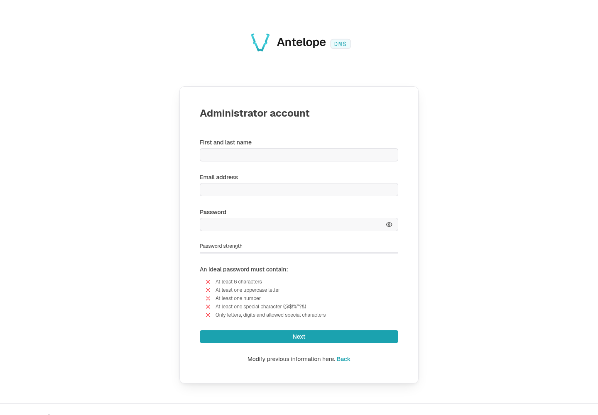

# Built-in dashboard

Load the DMS with zero pages of your own and you already have a working product: an onboarding wizard, login and account screens, a dashboard shell with navigation and search, a settings area covering profile, security, team, and roles, plus background housekeeping. Every piece works out of the box, and every piece has an extension point when you outgrow it.

## The shell

Every page renders inside the same chrome:

- **Sidebar** — the search / command palette trigger and the navigation tree built from the three root groups (**Pages**, **Modules**, **Settings**) and whatever categories and modules your code registers ([Navigation](/docs/building/navigation)). Its footer holds Settings, Modules and the user menu, opened from the signed-in user's row. Users can pin pages as **favorites**, and the sidebar collapses to icons.
- **Header** — the sidebar-collapse toggle, the breadcrumb with its favorite star, quick actions and the notification bell (the light / dark / system choice lives in the user menu of the sidebar footer).
- **Footer** — copyright, locale switcher, and registered links.

A frontend layer extends every part of this shell through registries — header buttons, layout banners, sidebar widgets, footer links, app widgets and overlays ([Dashboard chrome](/docs/extending-the-dashboard/dashboard-chrome)) — and reskins it through app config ([Theming & branding](/docs/extending-the-dashboard/theming-and-branding)).

### The command palette

The search (Ctrl/Cmd+K) opens a command palette aggregating several groups, all permission-gated and fuzzy-searchable:

- **Quick actions** — backend-registered shortcuts that navigate somewhere, open a form, or fire an event, grouped by category. Your modules add their own ([Navigation](/docs/building/navigation#quick-actions-the-command-palette)).
- **Favorites & recents** — the user's pinned pages, and recently visited modules resuming at their last path.
- **Navigation** — every reachable page of the nav tree as a breadcrumbed link, broader than the sidebar.
- **Session** — profile, settings, account switching, a language submenu, copy-current-URL, and logout.

A frontend layer can contribute its own groups through the command-palette source registry ([Dashboard chrome](/docs/extending-the-dashboard/dashboard-chrome#command-palette-sources)). A module can also give the palette an **assistant mode**: Tab then switches the dialog to a prompt the module answers, and every search ends with an "Ask the assistant" item ([Dashboard chrome](/docs/extending-the-dashboard/dashboard-chrome#command-palette-assistant)).

### The notification center

The bell surfaces in-app notifications with a badge of what arrived since you last opened it, live over the user's realtime stream. Opening the bell resets the badge on every device but leaves the notifications unread: one becomes read when you open it or mark it read, and the Notifications entry of the settings keeps counting what is still unread. Your backend code sends notifications through the notification service ([Backend services](/docs/building/backend-services#notifications)); users choose which subjects they receive in their settings.

## First run: the onboarding wizard

A fresh instance has no users. Until one exists, every route funnels to `/onboarding`, a three-step wizard: **Platform** (the platform name, which then titles the browser tab and the sign-in page over the configured `meta.title`, and the administrator's language), **Administrator** (first and last name, e-mail and a password checked live against the five password rules), then **Ready** (next steps, then the dashboard). It registers the **first admin** — created as **platform owner**, attached to the default tenant — and marks the instance onboarded. From then on the wizard locks itself (it answers `412` to anyone who returns) and new users arrive by [invitation](/docs/auth-and-tenancy/authentication#how-users-enter-the-platform) — or by [self-registration](/docs/auth-and-tenancy/saas-mode) when the optional `dms-saas` module is loaded.

## The auth screens

Login, invite signup, two-factor challenge, email validation, password recovery, and the account picker all ship as public pages under `/auth/*`. The flows behind them — token rotation, 2FA methods, the password policy — are their own chapter: [Built-in authentication](/docs/auth-and-tenancy/authentication).

## The settings area

The **Settings** root group opens on an overview — the user's account summary, their recent account activity, and a card per settings page they can open — and groups its pages in two categories, each with its own navigation group:

- **Account** (`/settings/user/…`) — the user's own pages. Every signed-in member reaches them, with every component and action on them, without a role granting anything (the category is `memberAccess` — [Auth & permissions](/docs/auth-and-tenancy/auth-and-permissions#authenticate-pages)), so the Roles editor does not list them.
- **Workspace** (`/settings/workspace/…`) — the pages that manage the workspace as a whole. They keep requiring their permissions, granted through roles.

| Page              | Category  | What it does                                                                                                                                                                                                 |
| ----------------- | --------- | ------------------------------------------------------------------------------------------------------------------------------------------------------------------------------------------------------------ |
| **Profile**       | Account   | Avatar, name and email address. A security summary links to the Security page. A **Preferences & access** block sums up, one row each, the user's roles in the current workspace (with a link to Roles only when they can open it) and how Language & region, Notifications (unread count, subjects on) and Appearance are set, each row shown only when its page opens for the user. A **Your data** block lets the user download a JSON file of everything the DMS keeps about them — profile, preferences, memberships and roles, notifications, sessions, linked sign-in providers, invitations sent; never a password, two-factor secret or token — and delete their account behind their password and their typed e-mail. Deletion refuses the last owner of a workspace or of the platform, signs out every device, removes memberships, the exports they started (files included), notifications, provider links and two-factor data, keeps the invitations the user sent, and fires `USER_DELETED` ([Backend services](/docs/building/backend-services#lifecycle-hooks)). |
| **Language & region** | Account | Interface language, time zone (automatic from the browser, or any IANA zone), first day of the week, 12- or 24-hour clock and numeric or written dates, saved as they change. Stored on the account, so every device follows them, and applied by every date the dashboard writes ([Localization](/docs/building/localization#dates-and-times)). |
| **Security**      | Account   | What needs attention, the password (a change signs out every other device), the sign-in email (changed through a code sent to the new address), **two-factor** methods (authenticator app, email codes, backup codes; adding one asks for the password), and the **sessions** list with per-device revocation and "Sign out other sessions" ([Authentication](/docs/auth-and-tenancy/authentication)). |
| **Notifications** | Account   | Toggle received notification subjects, saved as they change; the inbox lists past notifications in a table — All / Unread tabs, mark all as read, delete all.                                                 |
| **Appearance**    | Account   | Color mode, interface density (small / normal / large), the sidebar's starting state, and accessibility options: reduce motion, increase contrast, always underline links. All per device.                   |
| **Shortcuts**     | Account   | The keyboard-shortcut reference, aggregated from every loaded layer.                                                                                                                                         |
| **Members**       | Workspace | The tenant's member table — invite by email (roles, language, owner flag, optional first/last name — required when skipping email validation), promote/demote tenant owners, force email validation, remove members. Owner-safety guards prevent removing the last owner. **Member invitations**, listed under it, holds the pending invitations, with edit, resend and cancel. |
| **Roles**         | Workspace | Create roles and grant permissions from the permission tree that your pages, components, and actions register, and preview what a role sees ([Auth & permissions](/docs/auth-and-tenancy/auth-and-permissions)). |

Your project can add its own settings pages — workspace settings under `workspaceSettingsCategory`, personal ones in a `memberAccess` category — see [Settings pages](/docs/building/settings-pages).

## Housekeeping the platform runs for you

Two scheduled tasks ship with the module:

- **Invite cleanup** — expires outdated invitations every night.
- **Export sweep** — removes expired completed or failed table exports every hour, leaving pending exports untouched.

Add to that the default-tenant bootstrap on first database initialization, and session `lastActiveAt` tracking on refresh.

## Where to go next

:::card-group

::card{title="Quickstart" icon="i-lucide-rocket" to="/docs/getting-started/quickstart"}
Register your first page next to all of this.
::

::card{title="Authentication" icon="i-lucide-key-round" to="/docs/auth-and-tenancy/authentication"}
The flows behind the auth screens.
::

::card{title="Dashboard chrome" icon="i-lucide-layout-template" to="/docs/extending-the-dashboard/dashboard-chrome"}
Add your own buttons, widgets, and links to the shell.
::

::card{title="Theming & branding" icon="i-lucide-palette" to="/docs/extending-the-dashboard/theming-and-branding"}
Your logo and colors instead of the defaults.
::

:::
